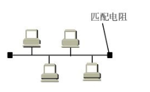

## 数据链路层的典例（局域网->以太网）

1. 数据链路层的信道分为点对点信道和广播信道；广域网使用的是点对点的信道，ppp协议（了解这点即可）；局域网一般使用的是广播信道，对应CSMA/CD协议；一般可以将局域网LAN理解为使用数据链路层协议的典例，但注意无线LAN和LAN是有区别的，LAN直接联想为下图。

   
2. 局域网根据网络拓扑进行分类，可以分为星形网，环形网，总线网（总线网两边的匹配电阻用于吸收有害电磁波）等。总线网以传统以太网（以太是传输介质）最为著名，**现在以太网几乎成了局域网的代名词**。

# 数据链路层

## 概述

1. 链路：可以理解为物理通路
2. 数据链路：软件+硬件
3. 数据链路以帧释放传输
4. 数据链路层的三个重要问题

* 怎么实现封装成帧
* 怎么进行差错检测
* 怎么实现可靠传输

可靠传输和不可靠传输：可靠传输，就是比如上层tcp的实现，如果接收到错误帧，就会想尽办法得到正确帧，**即如果能实现发送方发送什么，接收方就收到什么，这就叫做可靠传输**；不可靠传输，比如上层udp的实现，接收方得到到错误帧，直接丢弃即可

另外还有以下问题：使用广播信道的数据链路层和使用点对电信道的数据链路层；普通局域网的碰撞域和csma/cd协议；网桥和交换机的使用；无线局域网使用的csma/ca

## 封装成帧

**封装成帧** ：是指数据链路层交付给上层交付的协议数据单元添加帧头和帧尾使之成为帧

* 帧头和帧尾中包含的重要控制信息
* 作用之一就是帧定界

==》一种实现帧定界的方法是，在帧头和帧尾添加特殊字段**帧定界标志**，但不是所有协议都是这样实现的。

为了提高帧的传输效率，应当使帧的数据部分长度尽可能大一些，但是实际上每一种数据链路层协议都规定了帧数据部分的长度上限，称为MTU。

**透明传输 ：** 指数据链路层对于上层交付的传输数据没有任何限制，就好像数据链路层不存在，数据链路层是透明的一样。

==》因此数据链路层允许上层的传输内容出现帧定界标志（只是字段相同），但是会想办法避免被接收方认为是一个帧定界标志，主要解决方式如下：将有效载荷里出现的“帧定界标志”前加入一个转义字符，以避免它被认为是帧的结尾。

==》具体的来说，面向字节的物理链路使用字节填充或者字符填充的方法实现透明传输；面向比特的物理链路使用比特填充的方法实现透明传输

## 差错检测

主要考点有奇偶校验码，crc循环校验，以及汉明码。具体看视频，看例题

## 可靠传输（重要，可联系tcp，到tcp时注意区分他们“可靠”的不同点）

对于差错检验的结果，该如何处理检验出出错的帧呢？

如果数据链路层向上层提供：

**不可靠的传输服务**：仅仅丢弃有误码的帧其他什么也不做

**可靠的传输服务**：想办法实现发送端发什么，接收方就受到什么

一般情况下，**有线链路**的误码率比较低，因此并不要求数据链路层向上层提供可靠传输服务，即使出现了误码，可靠传输的问题由上层处理，比如tcp；但是**无线链路**的误码率较高，需要数据链路层向上层提供可靠传输服务

整体来说，**传输差错**包括：

* 分组丢失
* 分组失序
* 分组重复
* 比特差错等

一般来说，前三者不会出现在数据链路层，而出现在上层。

==》无线局域网一般要求数据链路层实现可靠传输，但是以太网不要求（以太网可以视为有线局域网）。

==》IP向上层提供的是无连接，不可靠的传输服务；tcp向上层提供的是，面向连接的可靠传输服务，udp向上层提供的是无连接，不可靠的传输服务。一般可靠传输的实现需求比较大。

## 可靠传输的三种实现的基本机制（重要）

注意这三种机制的原理并不仅限于数据链路层，所有需要实现可靠传输的协议都可以应用。

但实际上传输层的情况是动态窗口，情况更复杂，所以协议有所不同：

### 停止-等待协议SW

### 回退N帧协议GBN

### 选择重传协议SR

## 点对点协议PPP

点对电协议PPP使用场景如下：1，拨号上网和专线连接，2，宽带接入，3，**路由器之间的连接**

具体讲解见湖科大

## 媒体接入控制MAC（Medium Access Control）

概念介绍：

共享信道需要着重考虑的一个问题就是如何协调多个发送和接受站点对一个共享传输媒体的使用，即**媒体接入控制**

媒体接入控制具体有两种解决方法：

**静态划分信道**：频分多址，时分多址，码分多址

**动态随机接入控制**：受控接入（分为集中控制和分散控制），随机接入

**其中静态划分信道的方法都非常不灵活，一般都素和在物理层使用。**

**集中控制**：有一个站点以循环的凡是轮询每个站点有无数据发送，只有被轮询到的站点才能发送数据，最大缺点就是存在单点故障问题。

**分散控制**：各个站点是平等的，并连接成一个环形网络，令牌（一个特殊控制帧）沿环逐站传递，接收到的令牌的站点才有权发送数据，并且在发送完数据之后传递给下一个站点。主要典例网络有：IEEE 802.5令牌环网，IEEE 802.4令牌环网，光纤分布式数据接口FDDI等。

**目前信道受控接入的网络大部分已经被淘汰**。

**随机接入**：**所有站点通过竞争，随机地在信道上发送数据。如果恰巧有两个或更多的站点在同一时刻发送数据，则信号在共享媒体上就要产生碰撞（即发生了冲突）。使得这些站点的发送都失败。因此，这类协议要解决的关键问题是如何尽量避免冲突及在发生冲突后如何尽快恢复通信。著名的共享式以太网采用的就是随机接入。**

**随着技术的发展，交换技术的成熟和成本的降低，具有更高性能的使用点对点链路和链路层交换机的交换式局域网在有线领域已完全取代了共享式局域网，但由于无线信道的广播天性，无线局域网仍然使用的是共享媒体技术。**

## 静态划分信道

自己再看视频。。。。。。

### 随机接入-CSMA-CD协议

一般在有线局域网使用。

载波监听多址接入/碰撞检测 CSMA/CD（carrier sense Multiple Access/Collision Detection)

### 随机接入-CSMA-CA协议

一般在无线局域网使用。

## MAC地址，IP地址，ARP协议

综述：

MAC地址是以太网mac子层使用的地址（数据链路层），IP地址是TCP/IP体系结构网际层所使用的地址（网际层）,ARP协议属于TCP/IP中的网际层，**其作用是已知设备分配到的IP地址，使用ARP协议可以通过该IP地址获取到设备的MAC地址**。

mac地址：作用就是表示本主机的唯一标识

ip地址；在全网中可以标识网络

注意跨网路传输的时候，mac地址是“短期目标”，ip地址是长期目标

下面介绍arp协议：实现通过ip地址获取mac地址

关于arp协议，注意这点即可

总结以上说明：

## 集线器和交换机

### 以太网交换机和集线器的区别

**以太网交换机**通常都有多个接口，每个接口可以直接与一台主机或者另一个以太网交换机相连，**一般工作在全双工状态，即可收发帧不能同时进行**

但是**集线器**是共享总线的，需要使用csma/cd协议来协调各个主机争用总线，**只能工作在半双工状态，即收发帧不能同时进行**

以太网交换机工作在数据链路层（也包括物理层），它收到帧后没在帧交换表中查找帧的目的mac地址所对应的接口号，然后通过这个接口转发帧。

以太网交换机是一种即插即用设备，内部的帧交换网是通过子学习算法自动逐步建立起来的。具体处理情况如下

* 以太网交换机，可以处理广播帧，此时**看起来**和集线器的处理是相同的。
* 但是当多个与交换机（集线器）相连的主机，某两台需要通信时，情况是不同的，对于集线器，所有主机都收到了被发送的帧，只是不是目标主机的主机会在数据链路层丢弃了这个帧；而对于交换机，只有目标主机会受到这个帧
* 当多个与交换机（集线器）相连的主机，多台主机同时都要向目标发送信息的时候 ，集线器无法处理此问题，只会发生碰撞，触发重传；但交换机会存储所有发送的帧，不处罚碰撞地，把帧逐个发送给目标

以太网对于帧有两种转发方式：1，存储转发2，直通交换（采用基于硬件的交叉矩阵，使得时延非常小，但是不检查是由有差错）

**注意区分广播域和碰撞域的概念**

集线器和交换机都扩大了广播域，但只有集线器扩大了碰撞域，交换机没有。

### 以太网交换机自学习和转发帧流程

例子如下，注意一开始，以太网交换机的帧交换表都为空：

注意登记是根据源mac地址等级，转发是根据目的地址转发

如果没有在帧交换表里面找到目的地址，那么就对**除了发送接口以外的所有接口进行转发**，也称盲目泛洪。

端口可以出现一对多的情况

PDU：protocol Data Unit 协议数据单元

### 以太网交换机的生成树协议STP

> 如何提高以太网的的可靠性？（就是确保以太网两主机之间的链路不会轻易断开）

可以通过添加冗余链路可以提高可靠性

> 但是冗余链路也会带来负面效应->形成网络环路

网络环路会导致以下问题：

1. 广播风暴：起步时刻，大量耗费网络资源
2. 主机收到大量重复的广播帧：耗费主机资源
3. 帧交换表的震荡漂移（这是由于网络环路和交换机没有本身的地址导致的）

> 以太网交换机使用生成树协议STP（spinning Tree Protocol）可以增加冗余链路来提高网络可靠性的同时又避免网络环路带来的各种问题
>
> 即不论交换机次啊用怎样的物理连接，交换机都能够自动计算并搭建一个逻辑上没有环路的网络，其拓扑结构必须是树形的（无逻辑环路）

以太网交换机就很根据算法，自动阻塞一些接口，而当某些链路出现问题，导致部分接口无效后，又会为了维持链路，释放部分之前阻塞的接口。

## 虚拟局域网VLAN

### 概述

> 广播会占用网络大量资源（以目前交换机构成的网络来说）
>
> 但是广播又是很多协议不可避免的

> 但是可以使用路由器（工作在网络层的设备）来分割广播域，路由器默认情况下不会对广播数据包进行转发
>
> 但是路由器的成本较高，所以大量使用仅来隔离广播域不现实、

==》虚拟局域网产生

> 虚拟局域网，是一种将局域网内的设备划分为与物理位置无关的逻辑组的技术，这些逻辑组具有某些共同的需求。
>
> 不同的vlan之间不能进行广播通信

