# 网络层

## 概述

网络层的主要任务是**实现网络互连，进而实现数据包在各个网络之间的传输。**

网络层需要解决以下主要问题：

> 网络层要向运输层提供怎样的服务

因特网使用的TCP/IP协议体系的网际层，向上提供的是无连接的不可靠的数据报服务；而ATM，帧中继，和X.25提供的网络层提供的都是面向连接，可靠的虚电路服务。

> 网络层的寻址问题

使用ip实现

> 路由选择问题

路由器和路由表

实例：因特网是目前全球使用用户数量最多的互联网，它使用TCP/IP协议栈，由于TCP协议栈中使用网络协议IP，它是整个协议栈的核心协议，因此在TCP/ip协议栈中的网络层常被成为网际层

==》主要基于TCP/IP协议栈的网际层来学习网络层

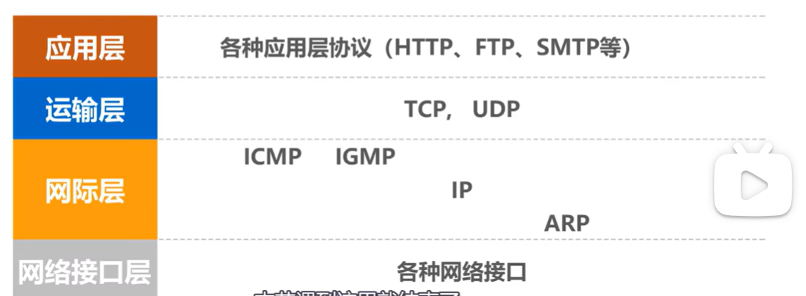

## 网路层提供的两种服务类型

> 面向连接的虚电路服务

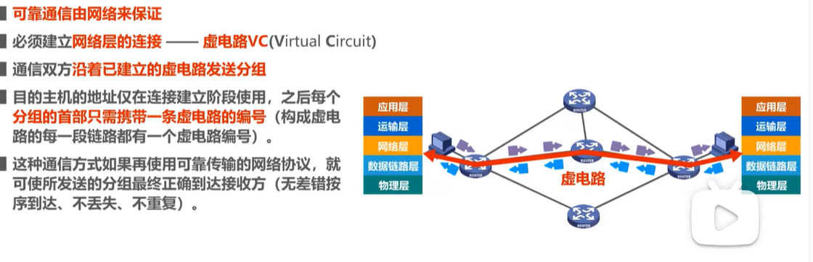

> 不面向连接的数据报服务

## ip地址

> 目前仍在使用的是ipv4地址，尽管目前已经声称分配完毕了

### ipv4的编址进展

> 早期使用分类编址

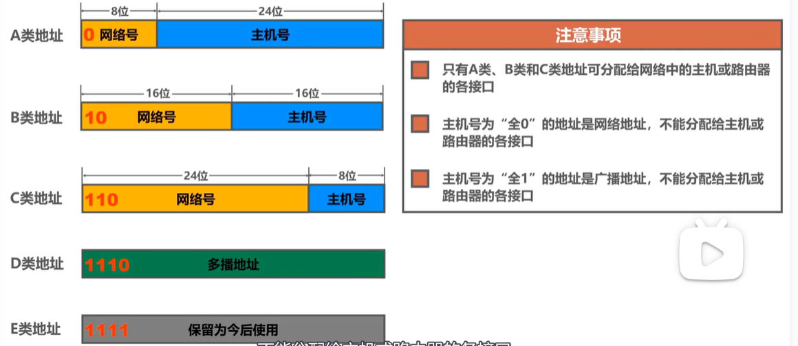

> 使用子网掩码的分类方式

> cier，路由聚合的方式

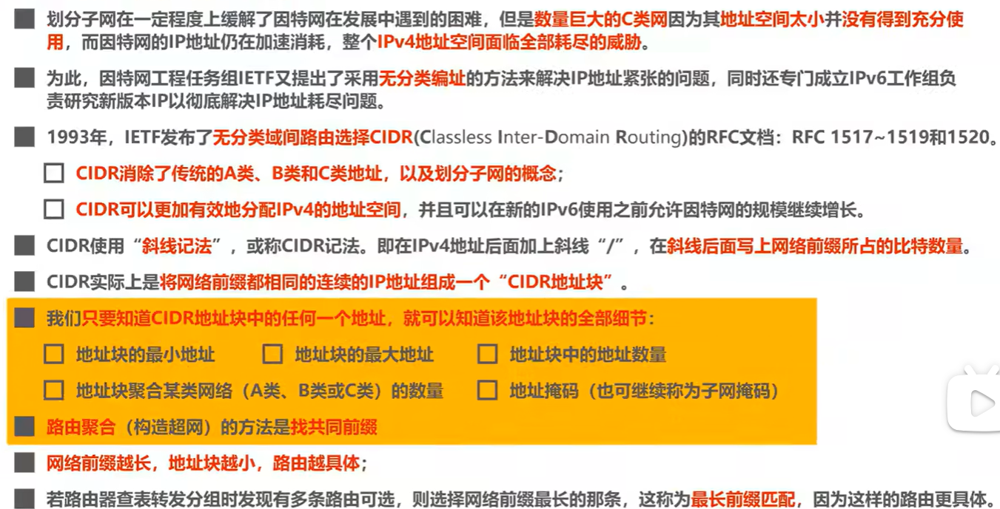

关于ip分类可以再看看，需要注意区分划分子网和路由聚合的区别。

**划分子网（Subnetting）** **定位**：**网络内部**的地址管理，面向主机分配。

* **目的**：将一个较大的IP地址块（如一个C类网络）划分为多个较小的子网，优化地址利用率。划分子网，作用在主机上，比如每台主机都有子网掩码。

**构建超网（Supernetting）定位**：**网络之间**的路由优化，面向路由器聚合。

* **目的**：将多个连续的小型网络合并为更大的CIDR块，减少路由表条目。作用在路由器上，比如路由器每个四字节ip地址后紧跟的斜线内容。

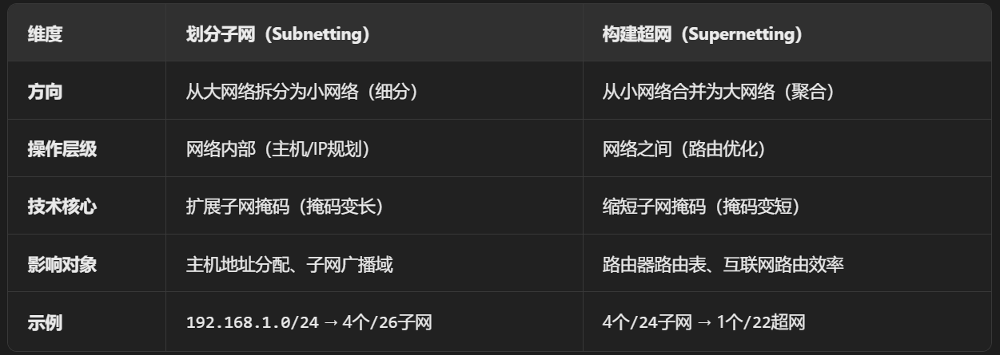

## ip数据报的发送和转发过程

> 每一个数据报的发送和转发过程包含以下两个部分

1，主机发送ip数据报

2，路由器转发数据报

一般默认忽略使用arp协议来获取目的主机ip或者rarp获取路由器接口的mac地址的过程，以及以太网交换机自学习和转发帧的过程

具体流程应该分为涉及的nat和不涉及nat的ip数据报转发，但更详细的区分如下：

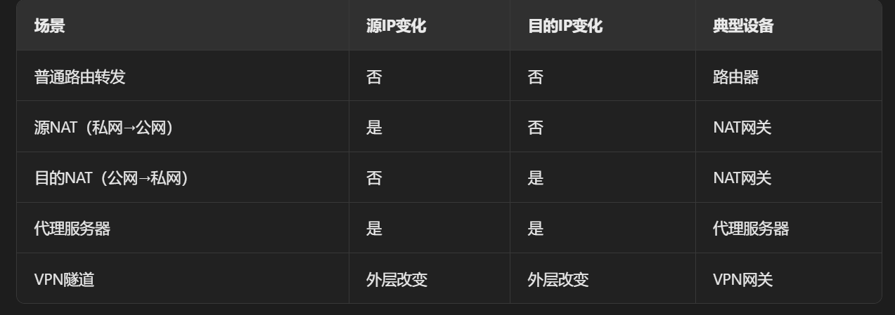

## 路由选择协议

。。。。。。。都看看，和差错检验一样的单独考点而已。

分为两种：

> 静态路由选择协议
>
> 由人工配置的网络路由，默认路由，特定主机路由，黑洞路由都属于静态路由。
>
> 静态路由简单，开销小，但是不能及时适应网络状态的变化==》小规模网络使用

> 动态路由选择协议
>
> 路由器通过路由选择协议自动获取路由信息
>
> 比较复杂，开销比较大，但能较好适应网络状态的变化==》大规模网络使用

因特网使用的路由协议主要特点：

> 自适应：动态路由选择，能较好地适应网络状态的变化
>
> 分布式：路由器之间交换路由信息
>
> 分层次：将整个因特网划分为许多较小的自治系统AS（autonomous system）

举例：

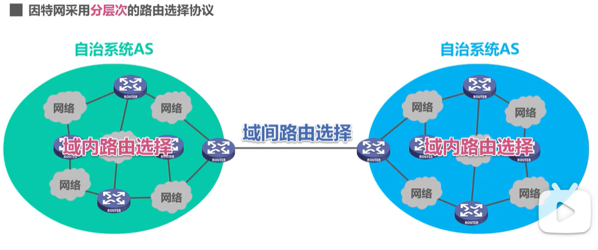

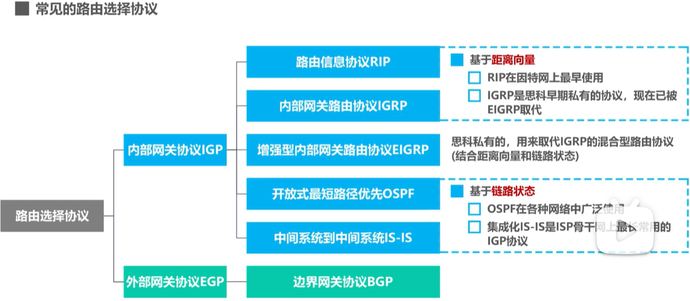

以下展示路由器的基本结构，注意路由选择部分的路由选择协议会周期性和其他路由器的路由信息进行交互。

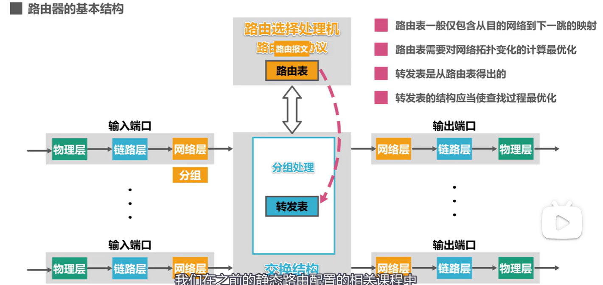

### RIP路由信息协议

> 1. rip要求自治系统AS内的每一个路由器都要维护从它到AS内其他每一个网络的距离记录，这是一组距离，称为“距离向量D-V（distance — Vector”）
> 2. rip使用跳数作为度量到达目的网络的距离：路由器到直连网络的距离定义为1，路由器到非直连网络的距离定义为经过的路由器数目加1，最多允许一条路径存在十五个路由器，“距离”等于十六时相当于不可达
> 3. rip认为好的路由就是距离短的理由，也就是通过的路由器数量最少（尽管可能对应链路的带宽很小）
> 4. 当到达同一目的网络有多条“距离相等”的路由的时候，会进行等价负载均衡，数据均分到这些链路上

rip的具体说明：

> rip和谁交换信息：仅和相邻路由表交换信息
>
> 交换什么信息：自己的路由表
>
> 何时进行交换：周期性交换

rip的基本工作过程：

> 路由器刚开始工作时，只知道到自己的直连网络距离是1
>
> 每个路由器只会和相邻路由器周期性交换信息并更新路由信息
>
> 若干次交换和更新后，各个路由器都知道到达本AS内各网络的最短距离和下一条地址，这叫做收敛

实例：

D接收到C的路由表，进行改造（将距离加1），然后用改造表更新D自己的路由表

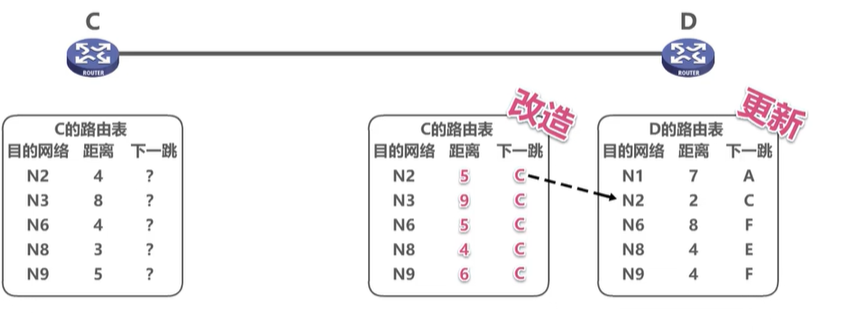

更新后的结果和原则总结如下：

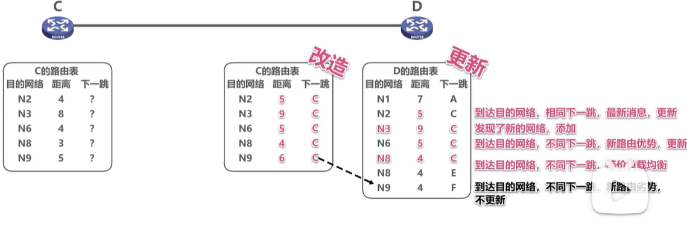

**需要注意的是这里为什么D的路由表里N2的距离扩大了，这是因为更新之前，数据就需要通过C来转发，此时改造的路由表里到N2的距离发生了变化，说明网络结构发生了变化，D就要更新最新信息（很容易错，注意！！！！）**

注意rip协议存在的“坏消息传得慢的特点”：这是由于每个路由表都会优先选择距离较小的信息所导致的。

**一条路径不通后，能经过这条路径到达目的地的其他所有节点需要来来回回更新很久很久很久后，才全部知道此路不通。**

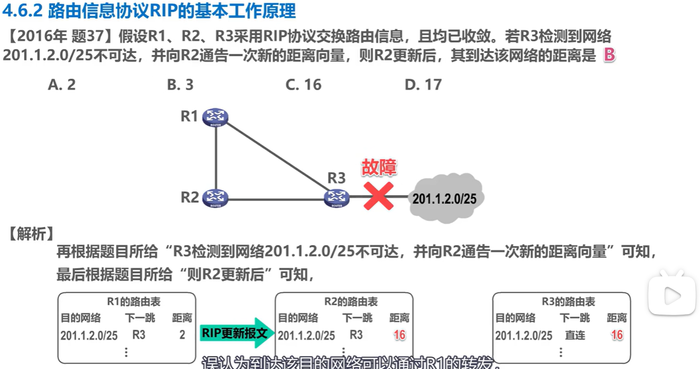

### OSPF开放最短路径优先

> 是为了是为了克服rip的缺点被开发出来的
>
> 开放表明不是受到一家厂商的控制， 而是公开发表的
>
> "最短路径优先"是因为使用了，Dijkstra提出的最短路径算法SPF
>
> OSPF是基于链路状态的，而不是和rip一样基于距离向量的
>
> OSPF使用SPF计算力有，从说算法上保证了不会出现路由环路
>
> OSPF不会限制网络规模，更新效率高，收敛速度快
>
> 链路状态是指本路由器和那些路由器相邻，以及相应链路的“代价”（代价可以用费用，距离，实验，带宽，等等来表示，有具体网络管理人员决定）

代价的举例如下：

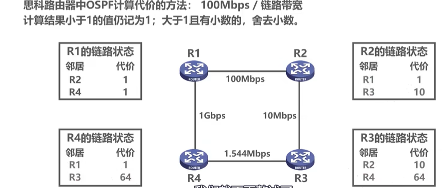

周期性进行“问候”，确保邻居的“可达状态”，hello分组封装在IP数据报里。

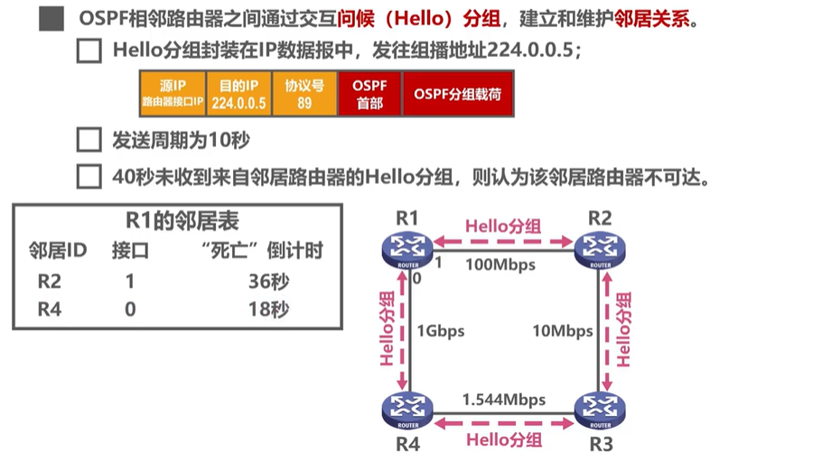

很多很多细节，自己再看视频，不总结了

* [ ] https://www.bilibili.com/video/BV1c4411d7jb?spm_id_from=333.788.player.switch&vd_source=ca9da36b7d96356c374634b84d9f1b1a&p=52

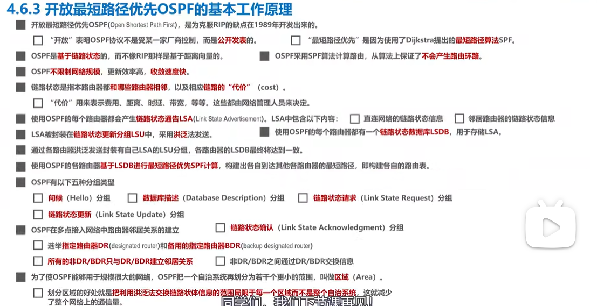

### 边界网管协议BGP

边界网关协协议

以上协议都是优化路由器的，讲深了容易超纲，基本考点都比较固定，记住基础的，考场推理就可以。

不过还是多看看。

## ICMP国际控制报文协议

王道书直接记忆

## 注意理解抓包的概念

！！！！！！！！！很重要
